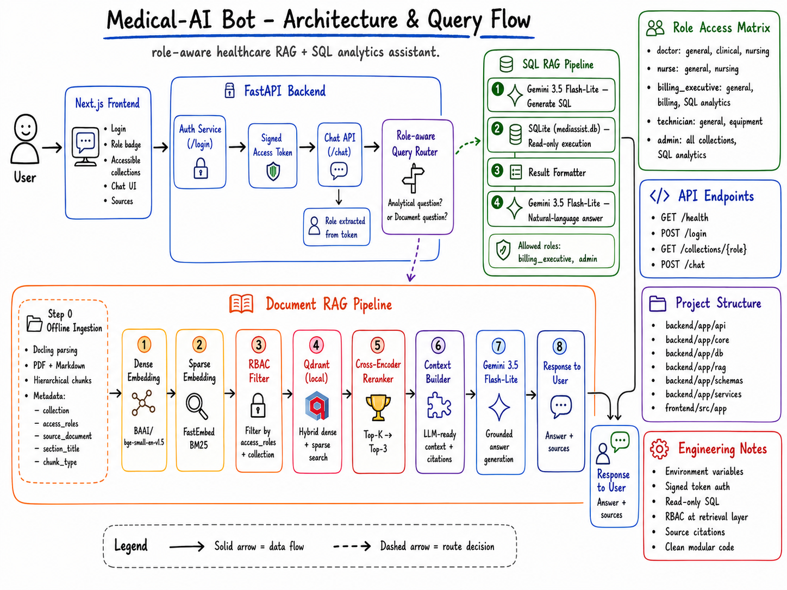

# Medical-AI Bot Frontend

This is the Next.js frontend for **Medical-AI Bot**, a role-aware healthcare assistant that connects to the FastAPI backend for secure document RAG and SQL analytics.

The frontend provides:

- Demo user login
- Active role display
- Accessible collections display
- Chat interface
- Retrieval type display
- Source citation display
- Clear blocked-access messages



---

## Tech Stack

| Area       | Technology      |
| ---------- | --------------- |
| Framework  | Next.js         |
| Language   | TypeScript      |
| Styling    | CSS             |
| API Client | Browser `fetch` |
| Backend    | FastAPI         |

## Environment Configuration

Create this file:

```text
frontend/.env.local
```

Add:

```env
NEXT_PUBLIC_API_BASE_URL=http://127.0.0.1:8000
```

Do not commit `.env.local`.

---

## Run the Frontend

From the frontend folder:

```powershell
cd C:\medical-ai-bot\frontend
npm run dev
```

Open:

```text
http://localhost:3000
```

---

## Backend Requirement

Before using the frontend, make sure the backend is running from the project root:

```powershell
cd C:\medical-ai-bot
.venv\Scripts\activate
python -m uvicorn backend.app.main:app --reload
```

Backend health check:

```text
http://127.0.0.1:8000/health
```

Expected response:

```json
{
  "status": "ok",
  "app_name": "Medical-AI Bot",
  "environment": "development"
}
```

---

## Demo Users

| User         | Username       | Password            | Role                |
| ------------ | -------------- | ------------------- | ------------------- |
| Dr. Mehta    | `dr.mehta`     | `doctor`            | `doctor`            |
| Nurse Priya  | `nurse.priya`  | `nurse`             | `nurse`             |
| Billing Ravi | `billing.ravi` | `billing_executive` | `billing_executive` |
| Tech Anand   | `tech.anand`   | `technician`        | `technician`        |
| Admin Sys    | `admin.sys`    | `admin`             | `admin`             |

---

## Frontend Flow

1. Select a demo user.
2. Click **Login**.
3. The frontend calls:

```text
POST /login
```

4. The backend returns a signed access token and role.
5. The frontend calls:

```text
GET /collections/{role}
```

6. The UI displays accessible collections.
7. The user submits a question.
8. The frontend calls:

```text
POST /chat
```

9. The answer, retrieval type, role, and sources are displayed.

---

## Supported Backend Endpoints

| Method | Endpoint              | Used For                      |
| ------ | --------------------- | ----------------------------- |
| `GET`  | `/health`             | Backend health check          |
| `POST` | `/login`              | Demo login                    |
| `GET`  | `/collections/{role}` | Role-based collection display |
| `POST` | `/chat`               | Main chat interaction         |

---

## Manual Test Cases

### Billing SQL RAG

Login as:

```text
Billing Ravi - Billing Executive
```

Ask:

```text
How many claims are rejected?
```

Expected:

```text
There are 12 rejected claims.
Retrieval type: SQL RAG
No document sources returned.
```

---

### Nurse SQL Access Block

Login as:

```text
Nurse Priya - Nurse
```

Ask:

```text
How many claims are rejected?
```

Expected:

```text
Access Blocked
As a nurse, you do not have access to SQL analytics.
```

---

### Doctor Document RAG

Login as:

```text
Dr. Mehta - Doctor
```

Ask:

```text
What drug formulary guidance is available for antibiotic use?
```

Expected:

```text
Retrieval type: Hybrid RAG
Sources from clinical or nursing collections.
```

---

### Nurse Document RAG

Login as:

```text
Nurse Priya - Nurse
```

Ask:

```text
What infection control guidance should nurses follow?
```

Expected:

```text
Retrieval type: Hybrid RAG
Sources from nursing or general collections only.
```

---

### Technician Document RAG

Login as:

```text
Tech Anand - Technician
```

Ask:

```text
What equipment maintenance guidance is available?
```

Expected:

```text
Retrieval type: Hybrid RAG
Sources from equipment or general collections only.
```

---

## Build Check

Run:

```powershell
cd C:\medical-ai-bot\frontend
npm run lint
npm run build
```

Expected:

```text
Compiled successfully
```

---

## Notes

- The frontend does not enforce role permissions.
- Role permissions are enforced by the FastAPI backend.
- The access token is sent to the backend with each chat request.
- Document answers show source citations when available.
- Blocked requests show a clear access message.
